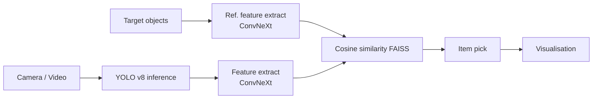

<h1 align="center">🛒 Regalscan – Real-time Shelf-Monitoring with YOLO v8 & ConvNext </h1>

 Computer-Vision pipeline that detects products on retail shelves to improve the shopping experience. 
 <strong>Python • YOLO v8 • OpenCV • FAISS • AI</strong>

  
  
  

---

## ✨ Why Regalscan?

* **Lost sales** ≈ 4 % in German retail stem from empty facings / stock-outs and/or people giving up searching for their product after a couple of minutes. 
* Store audits are still **manual & costly**.  
* Existing CV solutions struggle with **lighting & occlusion** in real stores.

Regalscan shows how a **compact edge-model (YOLOv8-n)** can help finding the right product
That can improve the shopping experience and in enhance the customer binding, if provided by a supermarket
Many additional features as in-shop navigation can be included as well.

---

## Architecture

## Task
This demo script shall evaluate an idea of shopping assistance:
A list of often bought articles shall be detected and highlighted in the supermarket shelf in order to assist the user finding the articles and speed up the shopping experience

## Method
The task is divided into 3 steps:
- Extraction of the feature vectors for each article
- Object detection of relevant object (a standard YOLO model is used)
- Feature vector calculation and correlation to all pre-scanned articles
Finally, if an object is detected, it is marked in the video

## Realization
The script is a python script using Pytorch, Ultralytics and Timm framework.
It can be run on a PC with GPU support.

performed steps:
Object detection on a standard YOLO 8 small model. The small model is absolutely sufficient as only the bounding boxes of relevant objects are used. The detected classes are not important. Classes are only used to delete irrelevant objects like persons.

Main evaluation step:
For all pre-selected bounding boxes, a feaure vector is being calculated
It has turned out, that the ConvNext Tiny model, pretrained in22ft1k achieves the best performance in generating unique feature vectors.
To further improve the differentition performance, the most relevant elements inside the feature vectors are being selected

Pytorch, Timm, Ultralytics, OpenCV shall be installed via PIP
My versions are:
...
(This is running safe on Win11 + I13700 + GTX4070Ti)

## Run
To run and evaluate start main.py

## Test files
In the example folder, there are demo pictures of objects to be detected and a video simulating the walk through a supermarket
Feel free to use other article photos and videos!

 
